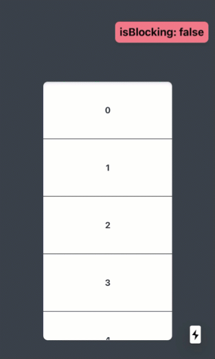

# useBlockScroll

`useBlockScroll` is a react hook for enabling and disabling document.body rubberband scrolling on mobile devices when interacting with a overflowabling child that reaches an edge.



<br>
<br>
<br>
<br>
<br>
<br>

# Table of Contents

- [Installation](#Installation)
- [Usage](#Usage)
- [Arguments](#Arguments)

  1. [`ref`](#1.-ref)
  2. [`options`](#2.-options)

     - [`axis`](#axis)
     - [`onBlock`](#onBlock)
     - [`onUnblock`](#onUnblock)

- [Return Value](#Return-Value)
  - [`enable`](#enable)
  - [`disable`](#enable)
- [Example](#Example)

<br>
<br>
<br>
<br>
<br>
<br>

# Installation

```
npm install @jwdinker/use-block-scroll
```

<br>
<br>
<br>
<br>
<br>
<br>

# Usage

```jsx
import useBlockScroll from '@jwdinker/use-block-scroll';

function Component() {
  const ref = useRef();

  const [enable, disable] = useBlockScroll(ref);

  useEffect(() => {
    enable();
    return disable;
  }, [disable, enable]);

  return (
    <div ref={ref} id="scrollable_container">
      <Items />
    </div>
  );
}
```

<br>
<br>
<br>
<br>
<br>
<br>

# Arguments

`useBlockScroll` accepts 2 arguments:

<br>

## 1. `ref`

```ts
element:React.RefObject<HTMLElement> | HTMLElement
```

The first argument is a reference to an HTMLElement that when it.

<br>

```jsx
const ref = useRef();
const [enable, disable] = useBlockScroll(ref);

return <div ref={ref}></div>;
```

<br>
<br>
<br>

## 2. `options`

The options object contains the following configurable properties:

- [`axis`](#axis)
- [`onBlock`](#onBlock)
- [`onUnblock`](#onUnblock)

<br>
<br>
<br>

### `axis`

```ts
axis:'x' | 'y' | 'xy' = 'y'
```

The axis the scroll blocking is applied to.

<br>
<br>
<br>

### `onBlock`

The callback invoked when the body scroll blocking begins. At this point, the HTML element scroll has reached its edge boundary and a continuation in the same scroll direction would trigger a scroll event on the body.

<br>
<br>
<br>

### `onUnblock`

The callback invoked when the blocking ends. At this point, the direction of the scroll would not supersede the size constraint.

<br>
<br>
<br>
<br>
<br>
<br>

# Return Value

The return value is a tuple containing a enable and disable function.
<br>

```jsx
const [enable, disable] = useBlockScroll(ref);
```

<br>
<br>
<br>

## `enable`

```ts
enable = () => void;
```

The `enable` function enables the blocking of the rubber band effect on the document body. A `touchmove` event listener is added to both the document body and the useBlockScroll element in order to monitor the scroll position of the useBlockScroll element.

The block is triggered if:

- the scroll left or scroll top property exceeds the boundaries of the scrollable area.
- the direction of the swipe would cause the scroll left or scroll top property to exceed the scrollable area.

<br>

> Note: The function also adds an overflow property to the body element for the duration of the block.

<br>
<br>
<br>

## `disable`

```ts
disable = () => void;
```

The disable function removes:

- the touchmove event listener from both the document body and the referenced element.
- the `hidden` value from `overflow` property of document.body.style.

<br>
<br>
<br>
<br>
<br>
<br>

# Example

In this example:

- the `<Page>` component is larger than the viewport forcing the body to be scrollable.
- The `<Items>` component has children that are larger than the `<Container>`, forcing the container to also be scrollable.
- Since the ref is applied to the `<Container>`, anytime the `<Container>` is scrolling up and scrollTop is less than or equal to 0, or scrolling down and scrollTop is greater than or equal to scrollTop + `<Container>` size, overflow will be added to the document body and any future scrolll on the document.body will be prevented until the subsequent `touchend` event is invoked.

<br>

```jsx
import React, { useEffect, useRef } from 'react';
import styled from 'styled-components';
import useBlockScroll from '@jwdinker/use-block-scroll';
import upTo from '@jwdinker/up-to';

const Page = styled.div`
  height: 200vh;
  width: 100vw;
`;

const Container = styled.div`
  height: 50vh;
  width: 100vw;
  overflow: scroll;
  -webkit-overflow-scrolling: touch;
`;

const Item = styled.div`
  height: 20%;
  width: 100%;
  display: flex;
  align-items: center;
  justify-content: center;
  font-weight: bold;
  font-size: 30px;
  box-sizing: border-box;
  border: solid 1px black;
`;

const Items = () => upTo(0, 20, (key) => <Item key={key}>{key}</Item>);

function Component() {
  const element = useRef();

  const [enable, disable] = useBlockScroll(element, { axis: 'y' });

  useEffect(() => {
    enable();
    return disable;
  }, [disable, enable]);

  return (
    <Page>
      <Container ref={element}>
        <Items />
      </Container>
    </Page>
  );
}
```
