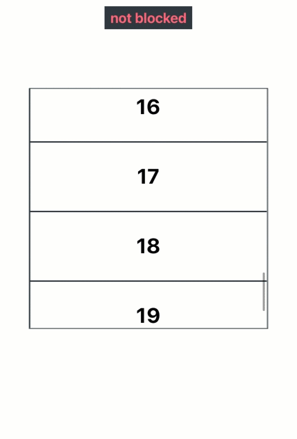

# useBlockScroll

`useBlockScroll` is a React hook for preventing rubber band effects on the document body from bubbling touch events.

- Targets iOS devices to prevent the rubber band effect on the body when scrolling an overflowing HTML element.
- Useful for nested scrolling and touch interactions such a swiping through elements.

For web documentation, [click here](https://www.notion.so/dinker/useBlockScroll-705077f03b784a3180b6c97dac4124fd).

<br><br><br><br><br><br>

# Installation

```
npm install @jwdinker/use-block-scroll
```

<br><br><br><br><br><br>

# Usage

```jsx
import useBlockScroll from '@jwdinker/use-block-scroll';
import useToggle from '@jwdinker/use-toggle';

function BlockScrollExample() {
  const element = useRef();

  const [isBlocking, { activate, deactivate }] = useToggle();

  const [enable, disable] = useBlockScroll(element, { onBlock: activate, onUnblock: deactivate });

  useEffect(() => {
    enable();
    return disable;
  }, [disable, enable]);

  const color = isBlocking ? '#79ff64' : '#ff6f83';

  return (
    <>
      <Details style={{ color }}>{isBlocking ? 'blocked' : 'not blocked'}</Details>
      <Page>
        <Container ref={element}>
          <Items />
        </Container>
      </Page>
    </>
  );
}
```

<br>



<br><br><br>

# Arguments

`useBlockScroll` accepts a React reference to an HTML `element` and an `options` object as arguments.

<br>

## element

`object`

```tsx
type HTMLElementReference = React.RefObject<HTMLElement | null | undefined>;
```

The react reference to an over-flowable HTML element. The `element` will be monitored for content egressing its boundaries.

<br><br>

## options

`object`

---

<br>

axis `string`

_default:_ `'y'`

```tsx
type BlockableAxis = 'x' | 'y' | 'xy';
```

The axis monitored for blocking.

<br>

---

<br>

onBlock `function`

Callback invoked when the next direction of the pointer movement would push the contents of the `element` outside its boundaries and trigger a rubber band effect on the document body.

<br>

---

<br>

onUnblock `function`

Callback invoked when the next direction of the pointer movement would _not_ push the contents of the `element` outside its boundaries and any movement prior was being blocked.

<br>

---

<br><br><br><br><br><br>

# Return Value

`array`

The return value is tuple containing the `enable` and `disable` handler function.

```jsx
const [enable, disable] = useBlockScroll(element);
```

<br><br>

## enable

`function`

```ts
type EnableBodyScroll = () => void;
```

Enables the blocking of the rubber band effect on the document body.

<br><br>

## disable

`function`

```ts
type DisableBodyScroll = () => void;
```

Disables the blocking of the rubber band effect on the document body.
