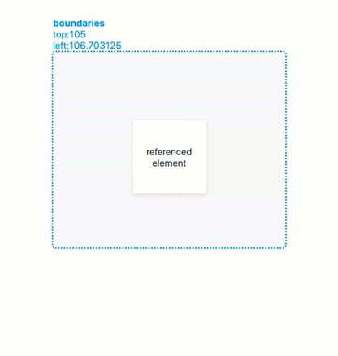

# useBoundaries

`useBoundaries` is a react hook that automagically updates and provides the position and size values of an element's parent boundary, relative to the viewport. The element can be nested anywhere in the DOM hierarchy.

<br>

<p align="center">
  
</p>

<br><br><br><br><br><br>

# Table of Contents

- [Installation](#Installation)
- [Usage](#Usage)
  <br>
- [Arguments](#Arguments)

  1. [fromRef](#.1-fromRef)

  2. [resizeDelay](#.2-resizeDelay)

* [Return Value](#Return-Value)

  - [Boundaries](#Boundaries)

    - [top](#.1-top)

    - [left](#.1-left)

    - [height](#.1-height)

    - [width](#.1-width)

<br><br><br><br><br><br>

# Installation

```
npm install @jwdinker/use-boundaries
```

<br><br><br><br><br><br>

# Usage

In this example, `<OverflowScrollingContainer>`'s position and size will be monitored, not `<Item>`.

```jsx
import useBoundaries from '@jwdinker/use-boundaries';

function Component() {
  const ref = useRef();

  const boundaries = useBoundaries(ref);

  return (
    <OverflowScrollingContainer>
      <Item ref={ref} />
    </OverflowScrollingContainer>
  );
}
```

<br><br><br><br><br><br>

# Arguments

useBoundaries accepts 2 arguments:

<br><br><br>

## 1. `fromRef`

```ts
 element:React.RefObject<HTMLElement>
```

A react reference to an HTML Element. This element scrollable parent's `top` and `left` properties will be monitored for position changes.

<br><br><br>

## 2. `resizeDelay`.

```ts
resizeDelay: number = 100;
```

The wait time after the last window resize event when the size and position will be updated.

<br><br><br><br><br><br>

# Return Value

The return value is a `boundaries` object containing the `top`, `left`, `height` and `width` of the referenced HTML Element's parent boundary.

```ts
const boundaries = useBoundaries(ref);

const { top, left, height, width } = boundaries;
```

<br><br><br>

## `Boundaries`

<br>

### `top`

```ts
top: number = 0;
```

The `top` value of closest boundary relative to the viewport.

<br><br><br>

### `left`

```ts
left: number = 0;
```

The `left` value of closest boundary relative to the viewport.

<br><br><br>

### `height`

```ts
height: number = 0;
```

The `height` of referenced HTML Element.

<br><br><br>

### `width`

The `width` of referenced HTML Element.

```ts
width: number = 0;
```
