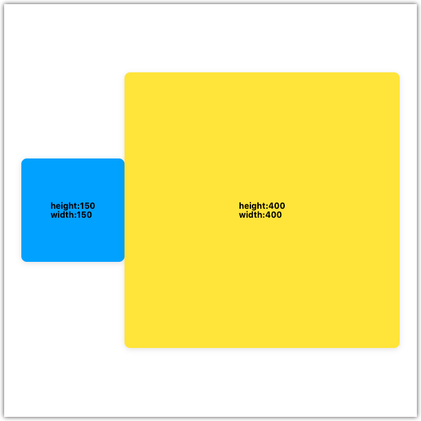

# useDimensionsList

`useDimensionsList` is a React hook that persists the dimensions of multiple referenced HTML elements.

<br><br><br><br><br><br>

# Installation

```
npm install @jwdinker/use-dimensions-list
```

<br><br><br><br><br><br>

# Usage

```jsx
import useDimensionsList from '@jwdinker/use-dimensions-list';

function Component() {
  const smallItemRef = useRef();
  const bigItemRef = useRef();

  const [dimensions, measureAtIndex] = useDimensionsList([smallItemRef, bigItemRef]);

  const [small, big] = dimensions;

  return (
    <Page>
      <SmallItem ref={smallItemRef}>
        {`height:${small.height}`}
        <br />
        {`width:${small.width}`}
      </SmallItem>

      <BigItem ref={bigItemRef}>
        {`height:${big.height}`}
        <br />
        {`width:${big.width}`}
      </BigItem>
    </Page>
  );
}
```

<br>



<br><br><br><br><br><br>

# Arguments

`useDimensionsList` accepts a single argument of an array of React referenced HTML elements.

<br>

## elements

`object | array`

```ts
type HTMLElementReference = React.RefObject<HTMLElement | undefined | null>;

type HTMLElementReferences = HTMLElementReference[];
```

<br><br><br><br><br><br>

# Return Value

`array`

The return value is tuple containing the array of `dimensions` objects and a `measureAtIndex` function.

<br>

## dimensions

`array`

```ts
interface Dimensions {
  height: number;
  width: number;
}

type ElementsDimensions = Dimensions[];
```

The array of objects containing the dimensions of each referenced HTML element. The order matches the order of the elements arguments.

<br><br>

## measureAtIndex

`function`

```ts
type MeasureAtIndex = (index?: number) => void;
```

A helper function that will remeasure the dimensions of an element at a specified index, or if left blank, will remeasure all the elements.
