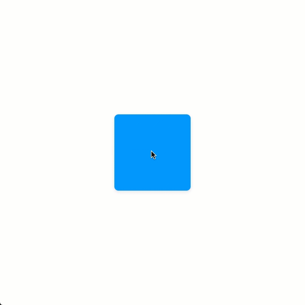

# useDrag

`useDrag` is a React hook that provides the persisted drag state values of an element from a mouse, touch, or multi-touch event. Web based documentation can be found [here](https://www.notion.so/dinker/useDrag-b4698da9d1d843649a059aff33913a58).

<br><br><br><br><br><br>

# Installation

```
npm install @jwdinker/use-drag
```

<br><br><br><br><br><br>

# Usage

```jsx
import useDrag from '@jwdinker/use-drag';

function Component() {
  const element = useRef();

  const [state, dragTo] = useDrag(element);

  const {
    translate: [x, y],
  } = state;

  const transform = `translate3d(${x}px,${y}px,0)`;

  return (
    <Page>
      <Item ref={element} style={{ transform }} />
    </Page>
  );
}
```

<br>



<br><br><br><br><br><br>

# Arguments

`useDrag` accepts a react reference to an HTML Element and an options object as arguments.

<br>

## element `object`

```tsx
type DragElement = RefObject<HTMLElement | undefined | null>;
```

The react reference to an HTMLElement used as the draggable element.

<br><br>

## options `object`

<br>

---

<br>

mouse `boolean`

_default:_ `true`

Enables the mouse events to trigger rotation. The rotation is computed with the mouse coordinates along the element's center point.

<br>

---

<br>

touch `boolean`

_default:_ `true`

```tsx
type TouchToTrigger = 1 | 2;
```

The number of touches needed to trigger a rotation event.

- If a single touch is used, the rotation is computed with the touch coordinates along the element's center point.
- If 2 touches are used, the rotation is computed between the center point of the 2 touches.

<br>

---

<br>

passive `boolean`

_default:_ `false`

A boolean that indicates the handler of the listener will never call `preventDefault`. This is used to improve performance for modern browsers so it is enabled for default. If `false` the browser will display a warning.

<br>

---

<br>

capture `boolean`

_default:_ `false`

A boolean indicating that events of this type will be dispatched to the registered listener before being dispatched to any EventTarget beneath it in the DOM tree.

<br>

---

<br>

canDrag `function`

```ts
type DragEvent = globalThis.TouchEvent | globalThis.MouseEvent;

type Coordinates = [number, number];
type Direction = 1 | 0 | -1;
type Directions = [Direction, Direction];

interface DragState {
  isDragging: boolean;
  phase: DragPhase;
  initial: Coordinates;
  origin: Coordinates;
  delta: Coordinates;
  xy: Coordinates;
  translate: Coordinates;
  move: Coordinates;
  direction: Directions;
}

type CanDrag = (nextState: DragState, event: DragEvent) => boolean;
```

A callback function that determines whether a drag is allowed. The function receives the potential next swipe state and the original drag event object.

- If the `true` the drag state will be updated, triggering a re-render.
- If `false` the state update will not occur and the component will not re-render.

<br>

---

<br>

initialTranslate `array`

_default:_ `[0,0]`

Sets the initial x and y translate coordinates in the drag state.

<br>

---

<br><br><br><br><br><br>

# Return Value

`array`

The return value is tuple containing the `drag` state object and a `dragTo` handler function.

<br>

## drag `object`

```ts
interface DragState {
  isDragging: boolean;

  //The current phase of the drag
  phase: 'idle' | 'start' | 'move' | 'end';

  // The origin x and y coordinates from the start of the drag
  origin: [number, number];

  // The initial x and y coordinates from the first drag event.
  initial: [number, number];

  // The variation in x and y coordinates from the previous drag event x and y coordinates
  delta: [number, number];

  // The current x and y coordinates of the touch or mouse event while a drag is active
  xy: [number, number];

  // The continuous x and y coordinates of the movement from its origin that persist between drag events
  translate: [number, number];

  // The difference in x and y coordinates from the origin x and y.
  move: [number, number];

  // The current x and y direction of the drag.
  // 1 for forwards.
  // -1 for backwards.
  // 0 for no change.
  direction: [number, number];
}
```

<br><br>

## dragTo `function`

```tsx
type DragTo = ({x: number = 0, y: number = 0) => void;
```

A handler function that sets the x and y translate values.
