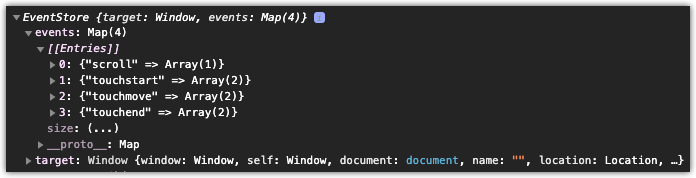

# useEventListener

`useEventListener` is a React hook that abstracts attaching/detaching event listeners with the option to consolidate event listeners. For latest documentation in an easily digestible format, [click here](https://www.notion.so/dinker/useEventListener-b198ef0007a64a33856d6d18b90429c9).

<br>
<br>
<br>
<br>
<br>
<br>

# Table of Contents

- [Installation](#Installation)
- [Usage](#Installation)
- [Arguments](#Arguments)

  1. [Ref](#1.-Ref)
  2. [Event Type](#2.-Event-Type)
  3. [Handler](#3.-Handler)
  4. [Options](#3.-Options)

     - [`passive`](#passive)
     - [`capture`](#capture)
     - [`once`](#once)
     - [`consolidate`](#consolidate)
     - [`storeName`](#storeName)

- [Return Value](#Return-Value)
  - [`listener.attach`](#listener.attach)
  - [`listener.detach`](#listener.detach)

<br>
<br>
<br>
<br>
<br>
<br>

# Installation

```
npm install @jwdinker/use-event-listener
```

<br>
<br>
<br>
<br>
<br>
<br>

# Usage

### Window

```jsx
import * as React from 'react';
import useEventListener from '@jwdinker/use-event-listener';

const { useEffect } = React;

function Component() {
  const _window = typeof window !== 'undefined' ? window : null;

  const handleScroll = () => {};

  const options = {
    passive: true,
  };

  const listener = useEventListener(_window, 'scroll', handleScroll, options);

  useEffect(() => {
    listener.attach();
    return listener.detach;
  }, [listener]);

  return <div style={{ height: '400vh', width: '100%' }} />;
}
```

<br>
<br>
<br>

### HTML Element

```jsx
import * as React from 'react';
import useEventListener from '@jwdinker/use-event-listener';

const { useRef, useEffect } = React;

function Component() {
  const ref = useRef();

  const handleTouch = () => {};

  const options = {
    passive: true,
  };

  const listener = useEventListener(ref, 'touchstart touchmove touchend', handleTouch, options);

  useEffect(() => {
    listener.attach();
    return listener.detach;
  }, [listener]);

  return <div ref={ref} />;
}
```

<br>
<br>
<br>
<br>
<br>
<br>

# Arguments

`useEventListener` accepts 4 arguments:

<br>

## 1. Ref

```ts
element:React.RefObject<HTMLElement | Window | Document | null | undefined> | Window | Document | null | undefined
```

The first argument is a react reference to an `HTMLElement`, `Window`, or `Document`, or the `Window` or `Document`.

<br>
<br>
<br>

## 2. Event Type

```ts
eventType = string;
```

The second argument is the event name or multiple event name separated by a space. For instance, `'touchstart touchmove touchend'`

<br>
<br>
<br>

## 3. Handler

```ts
handler = (event:any) => void;
```

The third argument is the handler function that will be invoked anytime the specified event type(s) occurs.

<br>
<br>
<br>

## 4. Options

Lastly, the 4th argument is an options object that contains the standard event options with the addition of `consolidate` and `storeName`:

- [`passive`](#passive)
- [`capture`](#capture)
- [`once`](#once)
- [`consolidate`](#consolidate)
- [`storeName`](#storeName)

<br>
<br>
<br>

### `passive`

```ts
passive: boolean = false;
```

A boolean that indicates the handler of the listener will never call `preventDefault`. This is used to improve performance for modern browsers so it is enabled for default. If `false` the browser will display a warning.

<br>
<br>
<br>

### `capture`

```ts
capture: boolean = true;
```

A Boolean indicating that events of this type will be dispatched to the registered listener before being dispatched to any EventTarget beneath it in the DOM tree.

<br>
<br>
<br>

### `once`

```ts
once: boolean = false;
```

A boolean that indicates the listener will only fire the event once and then remove itself.

<br>
<br>
<br>

### `consolidate`

```ts
consolidate: boolean = false;
```

A boolean that toggles the use of a custom event emitter on the element object. This is useful if there will be multiple listeners of the same event type on the element. For instance, the window may have multiple scroll listeners. If `true`, all event handlers of said type will be consolidate into a single listener.



<br>
<br>
<br>

### `storeName`

```ts
storeName: string = `__EVENT_STORE__`;
```

The name of the store on the element object if consolidate is set to `true`.

<br>
<br>
<br>
<br>
<br>
<br>

# Return Value

The return value is an object containing an `attach` and `detach` function.

<br>

```tsx
const listener = useEventListener(_window, 'scroll', handleScroll, options);

useEffect(() => {
  listener.attach();
  return listener.detach;
}, [listener]);
```

<br>
<br>
<br>

## `listener.attach`

```ts
attach = () => void;
```

Attaches the event listener(s) to the referenced element.

<br>
<br>
<br>

## `listener.detach`

```ts
attach = () => void;
```

Removes the event listener(s) from the referenced element.
