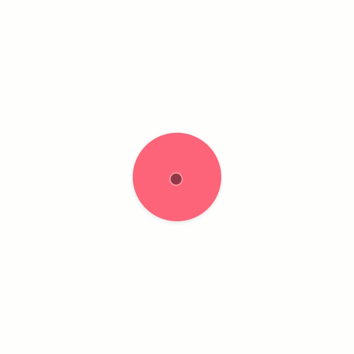

# useHold

`useHold` is a React hook that abstracts callbacks for phases of a hold gesture for touch and mouse events. For web documentation, [click here](https://www.notion.so/dinker/useHold-2c29c5a40cb44e219fae087fc68dbf00).

<br><br><br><br>

# Installation

```
npm install @jwdinker/use-hold
```

<br><br><br><br>

# Usage

```jsx
import useHold from '@jwdinker/use-hold';

function Component() {
  const element = useRef();

  const [animation, set] = useSpring(() => {
    return { transform: `scale(1)`, background: '#ff6f83' };
  });

  useHold(element, {
    onRelease: () => {
      set(() => {
        return { transform: `scale(1)`, background: '#ff6f83' };
      });
    },
    onHolding: (elapsed) => {
      set(() => {
        return { transform: `scale(${1 - elapsed / 1000})`, background: '#cb001b' };
      });
    },
    threshold: 300,
  });

  return (
    <Page>
      <Item ref={element} style={animation} />
    </Page>
  );
}
```

<br>



# Arguments

`useHold` accepts a react reference to an HTML `element` and an `options` object as arguments.

<br>

## element

`object`

```tsx
type HoldableElement = React.RefObject<HTMLElement | null | undefined>;
```

The React reference to an HTML element which listens for hold events.

<br><br>

## options

`object`

---

<br>

threshold `number`

_default:_ `300`

The duration in milliseconds before the `onThreshold` callback is invoked.

<br>

---

<br>

mouse `boolean`

_default:_ `true`

A boolean that indicates whether a mouse interaction on the `element` can trigger a hold gesture.

<br>

---

<br>

touch `boolean`

_default:_ `true`

A boolean that indicates whether a touch interaction on the `element` can trigger a hold gesture.

<br>

---

<br>

consolidate `boolean`

_default:_ `false`

A boolean that toggles the use of a custom event emitter on the element object. This is useful if there will be multiple listeners of the same event type on the element. For instance, the window may have multiple event listeners. If `true`, all event handlers of said type will be consolidate into a single listener.

<br>

---

<br>

onThreshold `function`

```ts
onThreshold:() => void;
```

A function invoked when the pointer is still within the boundaries of the `element` and the `threshold` has been surpassed.

<br>

---

<br>

onHolding `function`

```ts
onHolding:(elapsedTime: number) => void;
```

A function invoked for the duration of the hold until the `threshold` has been met and while the pointer is within the bounds of `element`.

<br>

---

<br>

onRelease `function`

```ts
onRelease:() => void;
```

A function invoked when the pointer has exited the `element`'s boundaries _or_ a touchend or mouseup event has occurred and the pointer is still within the `element`'s boundaries.

<br>

---

<br><br><br><br>

# Return Value

There is no return value.
