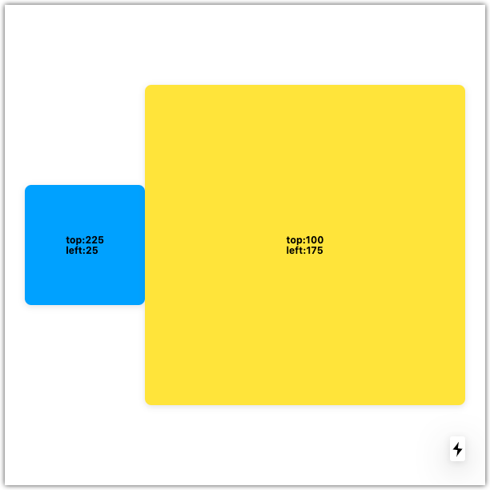

# useOffsetsList

`useOffsetsList` is a React hook that persists the offsets of multiple referenced HTML elements.

<br><br><br><br><br><br>

# Installation

```
npm install @jwdinker/use-offsets-list
```

<br><br><br><br><br><br>

# Usage

```jsx
import useOffsetsList from '@jwdinker/use-offsets-list';

function Component() {
  const smallItemRef = useRef();
  const bigItemRef = useRef();

  const [offsets, measure] = useOffsetsList([smallItemRef, bigItemRef]);

  const [small, big] = offsets;

  return (
    <Page>
      <SmallItem ref={smallItemRef}>
        {`top:${small.top}`}
        <br />
        {`left:${small.left}`}
      </SmallItem>
      <BigItem ref={bigItemRef}>
        {`top:${big.top}`}
        <br />
        {`left:${big.left}`}
      </BigItem>
    </Page>
  );
}
```

<br>



<br><br><br><br><br><br>

# Arguments

`useOffsetsList` accepts an array of React referenced HTML elements a position `type` as arguments.

<br>

## elements

`object | array`

```ts
type HTMLElementReference = React.RefObject<HTMLElement | undefined | null>;

type HTMLElementReferences = HTMLElementReference[];
```

<br><br>

## type

`string`

_default:_ `'relative'`

```ts
type OffsetType = 'relative' | 'absolute';
```

- when `'relative'`, the distance related offset properties are computed from the border of the current element relative to the inner border of the offset parent node.
- when `'absolute'`, the distance related offset properties are computed by traversing the DOM tree and accumulating the distance related offset properties of all the offset parent nodes.

<br><br><br><br><br><br>

# Return Value

`array`

The return value is tuple containing the array of `offsets` objects and a `measureAtIndex` function.

<br>

## offsets

`array`

```ts
interface Offsets {
  top: number;
  left: number;
  bottom: number;
  right: number;
  height: number;
  width: number;
}

type ElementsOffsets = Offsets[];
```

The array of objects containing the offsets of each referenced HTML element. The order matches the order of the elements arguments.

<br><br>

## measureAtIndex

`function`

```ts
type MeasureAtIndex = (index?: number) => void;
```

A helper function that will remeasure the offsets of an element at a specified index, or if left blank, will remeasure all the elements.
