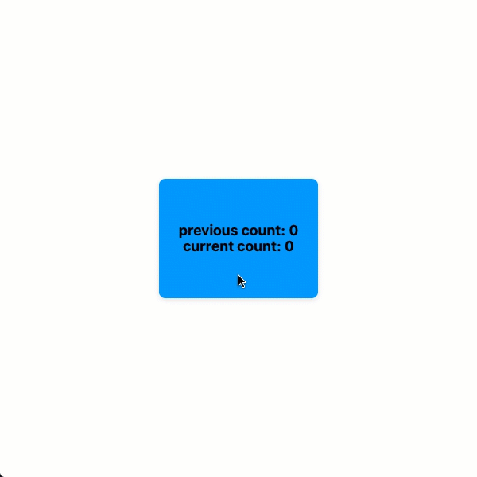

# usePrevious

`usePrevious` is React hook for accessing a value from a _previous render_. This hooks varies slightly from established examples as the value is initialized with the current value on the first render to avoid the extra equality check for undefined.

<br><br>

# Installation

```
npm install @jwdinker/use-previous
```

<br><br>

# Usage

```jsx
function Component() {
  const [count, setCount] = useState(0);

  const previousCount = usePrevious(count);

  const increment = useCallback(() => {
    setCount((currentCount) => currentCount + 1);
  }, []);

  return (
    <Page>
      <Button onClick={increment}>
        {`previous count: ${previousCount}`}
        <br />
        {`current count: ${count}`}
      </Button>
    </Page>
  );
}
```

<br>


