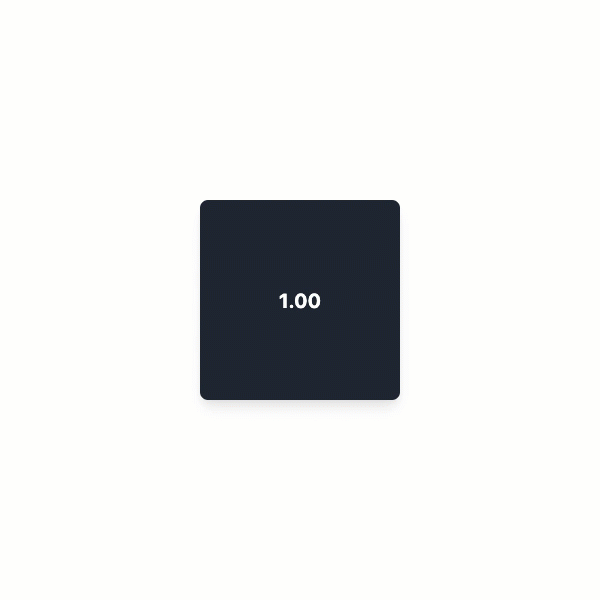
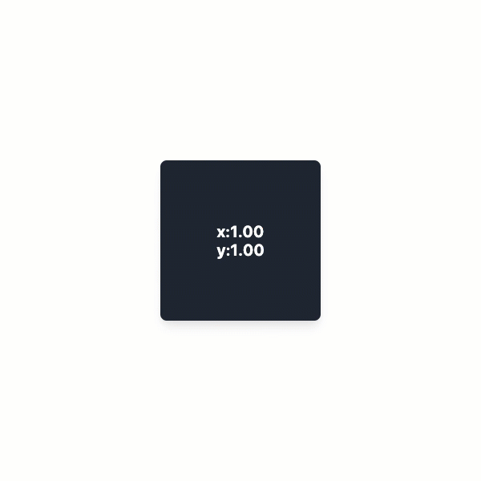

# useScale

`useScale` is a React hook that provides scale values for an element from a mouse, touch, or multi-touch event.
For web documentation, [click here](https://www.notion.so/dinker/useScale-86a670586bec429d8b1df3bb72a4dfff).

<br><br><br><br><br><br>

# Installation

```
npm install @jwdinker/use-scale
```

<br><br><br><br><br><br>

# Usage

<br>

```jsx
import useScale from '@jwdinker/use-scale';

const Component = () => {
  const element = useRef();

  const [scale] = useScale(element, {
    mouse: true,
    touch: 1,
    min: [0.5, 0.5, 0.5],
    max: [4, 4, 4],
  });

  const z = toDecimals(scale.xyz[2], 2);

  const transform = `scale(${z})`;

  return (
    <Page>
      <Item ref={element} style={{ transform }}>
        {z}
      </Item>
    </Page>
  );
};
```

<br>



<br><br><br><br>

```jsx
import useScale from '@jwdinker/use-scale';

const Component = () => {
  const element = useRef();

  const [scale] = useScale(element, {
    mouse: true,
    touch: 1,
    min: [0.5, 0.5, 0.5],
    max: [4, 4, 4],
  });

  const [x, y] = scale.xyz.map((val) => toDecimals(val, 2));

  const transform = `scale(${x},${y})`;

  return (
    <Page>
      <Item ref={element} style={{ transform }}>
        {`x:${x}`}
        <br />
        {`y:${y}`}
      </Item>
    </Page>
  );
};
```

<br>



<br><br><br><br><br><br>

# Arguments

`useScale` accepts a react reference to an HTML Element and an options object as arguments.

<br>
<br>

## element

`object`

```tsx
type ScalableElement = React.RefObject<HTMLElement | null>;
```

The react reference to an HTMLElement used as the scalable element.

<br>
<br>

## options

`object`

<br>

---

initialScale `array`
<br>
_default:_ `[1, 1, 1]`

        The initial x, y, and z values of the scale.

---

min `array`
<br>
_default:_ `[0.1, 0.1, 0.1]`

      The minimum allowed for the x, y, and z values of the scale.

---

max `array`
<br>
_default:_ `[2, 2, 2]`

        The maximum allowed for the x, y, and z values of the scale.

---

mouse `boolean`
<br>
_default:_ `false`

        Enables the mouse events to trigger rotation.   The rotation is computed with the mouse coordinates along the element's center point.

---

touch `number`
<br>
_default:_ 2
<br>

```ts
type TouchToTrigger = 0 | 1 | 2;
```

      The number of touches needed to trigger a scale event.

      - If a single touch is used,  the scale is computed with the touch coordinates along the element's center point.
      - If 2 touches are used, the scale is computed between the center point of the 2 touches.

---

<br><br><br>

# Return Value

`array`

The return value is tuple containing the `rotation` state object and a `rotate` handler function.

<br>

---

scale `object`

```ts
interface Scale {
  isScaling:boolean;
  distanceToCenter:[number,number,number];
  xyz:[number,number;number];
}
```

---

scaleTo `function`

```ts
type ScaleTo = (xyz: [number, number, number]) => void;
```

A handler function that manually sets the current x,y, and z scale.

---
