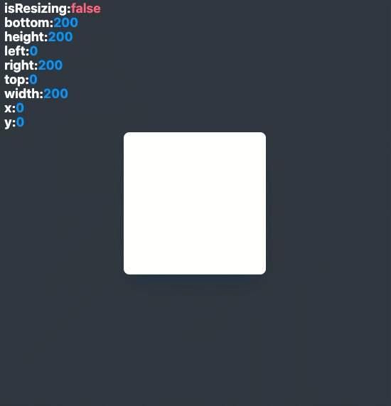

# useSize

`useSize` is a React hook that observes the content rectangle of element.

<br><br><br><br><br><br>

# Installation

```
npm install @jwdinker/use-size
```

<br><br><br><br><br><br>

# Usage

```jsx
import  from '@jwdinker/use-size'

function Component(){
  const ref = useRef();

  const [size, hasChangedSize] = useSize(ref);

  return <MyElement ref={ref}>;
};
```

<br>



<br><br><br><br><br><br>

# Arguments

`useSize` accepts a react reference to an HTML element and an initialContentRect object as arguments.

<br>

## element `object`

```tsx
React.RefObject<HTMLElement | null> | null | undefined
```

A react reference to an HTML element. The element will be observed for the life of the component.

<br><br>

## initialContentRect `object`

```tsx
interface ContentRect {
  height: number;
  width: number;
  top: number;
  left: number;
  right: number;
  bottom: number;
  x: number;
  y: number;
}
```

The initial content rectangle that will be merged with the default state.

<br><br><br><br><br><br>

# Return Value `array`

The return value is a tuple containing the following:

<br>

## measurements `object`

```ts
interface ContentRect {
  height: number;
  width: number;
  top: number;
  left: number;
  right: number;
  bottom: number;
  x: number;
  y: number;
}
```

<br><br>

## hasChanged `boolean`

A boolean for indicating if any property in the measurements has been changed. Any change to true will be immediately set to false to avoid equality checks.
