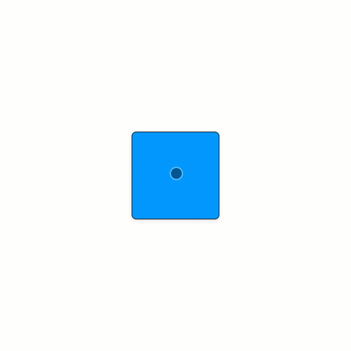

# useSwipe

`useSwipe` is an animation agnostic react hook that provides normalized, computed values from wheel and touch events for powering swipe animations. For web documentation, [click here](https://www.notion.so/dinker/useSwipe-df24f1bc151046e2a916398304a32ceb).

<br><br><br><br><br><br>

# Installation

```
npm install @jwdinker/use-swipe
```

<br><br><br><br><br><br>

# Usage

```jsx
import useSwipe from '@jwdinker/use-swipe';
import { useSpring, animated } from 'react-spring';

function Component() {
  const ref = useRef();

  const [state, snapTo] = useSwipe(ref, {
    wheel: true,
    touch: 1,
  });

  const {
    move: [moveX, moveY],
    phase,
  } = state;

  const [animation, set] = useSpring(() => {
    return {
      border: '1px solid black',
      transform: `translate3d(0px,0px,0)`,
    };
  });

  if (phase === 'end') {
    snapTo({ x: 0 });
  }

  set(() => ({
    border: '1px solid black',
    transform: `translate3d(0px,${moveY * -1}px,0)`,
  }));

  return (
    <Page>
      <Item ref={ref} style={animation} />
    </Page>
  );
}
```

<br>



<br><br><br><br><br><br>

# Arguments

`useSwipe` accepts a React reference to an HTML element and an options object as arguments.

<br>

## element

`object`

```ts
type SwipeableElement = React.RefObject<HTMLElement | null | undefined>;
```

<br>

## options

`object`

<br>

---

<br>

wheel `boolean`

_default:_ `true`

<br>

A boolean that determines whether wheel events will trigger swipe events.

<br>

---

<br>

touch `boolean`

_default:_ `true`

<br>

A boolean that determines whether touch events will trigger swipe events.

<br>

---

<br>

canSwipe `function`

_default:_ `() ⇒true`

<br>

```ts
type SwipeEvent = WheelEvent | TouchEvent;

type Coordinates = [number, number];
type Direction = 1 | 0 | -1;
type Directions = [Direction, Direction];

interface SwipeState {
  isSwiping: boolean;
  phase: DragPhase;
  origin: [number, number];
  move: [number, number];
  xy: [number, number];
  current: [number, number];
  direction: [Direction, Direction];
}

type CanSwipe = (nextState: SwipeState, event: SwipeEvent) => boolean;
```

<br>

A callback function that determines whether a swipe is allowed. The function receives the potential next swipe state. If the `true` the swipe state will be updated, triggering a re-render. If `false` the state update will not occur and the component will not re-render.

<br>

---

<br><br><br><br><br><br>

# Return Value

`array`

The return value is tuple containing the `swipe` state object and a `swipeTo` handler function.

<br>

---

<br>

swipe `object`

```ts
interface SwipeState {
  isSwiping: boolean;

  //The current phase of the swipe.
  phase: 'idle' | 'start' | 'move' | 'end';

  // The origin x and y coordinates from the start of the swipe.
  origin: [number, number];

  // The continous x and y coordinates of movement that persists between swipes.
  xy: [number, number];

  // The difference in x and y coordinates from the origin x and y.
  move: [number, number];

  // The current x and y direction of the swipe.
  current: [number, number];

  // 1 for forwards.
  // -1 for backwards.
  // 0 for no change.
  direction: [number, number];
}
```

<br>

---

<br>

swipeTo `function`

```ts
type SwipeTo = ({x: number = 0, y: number = 0) => void;
```

<br>

A handler function that sets the `xy` values of the swipe.

<br>

---

<br><br><br><br><br><br>

# Examples

## Snap

Below is trivial example of infinite swiping in both directions with snapping using the `react-spring` animation library.

If you intend to animate items that will be larger than the container, use the `CONTAINER_STYLE` and `TRANSLATOR_BASE_STYLE` with absolutely positioned children. This prevents the scrollbar from being triggered and messing with your animation. If percentages are used for animating items, the size will be based off of the `CONTAINER_STYLE` since it is relatively positioned.

```tsx
import React, { useRef } from 'react';
import styled from 'styled-components';
import { useSpring, animated } from 'react-spring';

import useSwipe, { CONTAINER_STYLE, TRANSLATOR_BASE_STYLE } from '@jwdinker/use-swipe';
import upTo from '@jwdinker/up-to';

const HEIGHT_OF_ITEM = 200;

const Item = styled.div`
  position: absolute;
  height: ${HEIGHT_OF_ITEM}px;
  width: 100%;
  box-sizing: border-box;
  border: 1px solid black;
  display: flex;
  align-items: center;
  justify-content: center;
  font-size: 50px;
  font-weight: bold;
`;

function roundToMultiple(multiple, digit) {
  if (digit > 0) return Math.ceil(digit / multiple) * multiple;
  if (digit < 0) return Math.floor(digit / multiple) * multiple;
  return multiple;
}

const Items = ({ startIndex, endIndex }) => {
  return upTo(startIndex, endIndex, (key) => {
    return (
      <Item style={{ top: `${key * HEIGHT_OF_ITEM}px` }} key={key}>
        {key}
      </Item>
    );
  });
};

const MemoizedItems = React.memo(
  Items,
  (previous, current) =>
    previous.startIndex === current.startIndex && previous.endIndex === current.endIndex
);

function SnapExample() {
  const ref = useRef();

  const options = {
    wheel: true,
    touch: true,
  };

  const [state, snapTo] = useSwipe(ref, options);

  const { phase, xy } = state;

  const y = xy[1];

  const [animation, set] = useSpring(() => {
    return {
      ...TRANSLATOR_BASE_STYLE,
      transform: `translate3d(0,0px,0)`,
    };
  });

  const index = roundToMultiple(HEIGHT_OF_ITEM, y) / HEIGHT_OF_ITEM;

  if (phase === 'end') {
    snapTo({ y: index * HEIGHT_OF_ITEM });
  }

  set(() => ({
    ...TRANSLATOR_BASE_STYLE,
    transform: `translate3d(0,${y * -1}px,0)`,
  }));

  return (
    <div style={{ height: '100vh', width: '100vw' }}>
      <div ref={ref} style={CONTAINER_STYLE}>
        <animated.div style={animation}>
          <MemoizedItems startIndex={index - 10} endIndex={index + 10} />
        </animated.div>
      </div>
    </div>
  );
}
```
