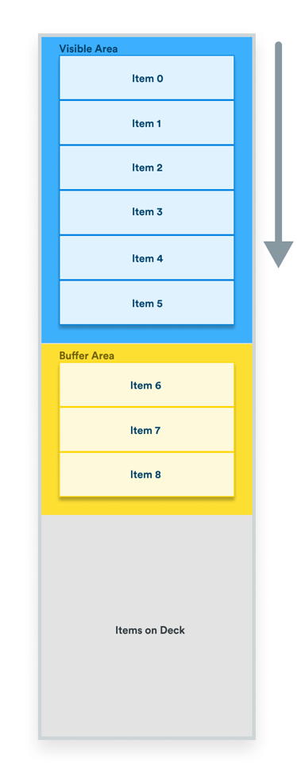

# useVirtualList

useVirtualList is a react hook that virtualizes elements to improve performance of scrollable and swipe-able list when dealing with a large amount of elements. A virtualized list only renders elements in and around the virtual area to prevent the DOM from being overloaded with elements, consequently, slowing down the browser.



<br>
<br>
<br>
<br>
<br>
<br>

# Installation

```bash
npm install @jwdinker/use-virtual-list
```

<br>
<br>
<br>
<br>
<br>
<br>

# Usage

```jsx
const Item = (props) => {
  const { style, index } = props;

  return (
    <div style={style}>
      <div style={ITEM_STYLE}>{index}</div>
    </div>
  );
};

function VirtualList() {
  const scrollerRef = useRef();
  const [scroll] = useScroll(scrollerRef);

  const options = {
    component: Item,
    itemSize: 20,
    axis: 'y',
    offset: scroll.y,
    direction: scroll.direction,
    responsive: true,
    numberOfItems: 10000,
    estimatedItemSize: 20,
    containerSize: 500,
    bufferSize: 3,
    bufferByDirection: true,
  };

  const { items, styles } = useVirtualList(options);

  return (
    <div>
      <div ref={scrollerRef} style={styles.container}>
        {items}
        <div style={styles.spacer} />
      </div>
    </div>
  );
}
```

<br>
<br>
<br>
<br>
<br>
<br>

# Options

---

- [`component`](#component)
- [`numberOfItems`](#numberOfItems)
- [`itemSize`](#itemSize)
- [`estimatedItemSize`](#estimatedItemSize)
- [`offset`](#offset)
- [`direction`](#direction)
- [`axis`](#axis)
- [`containerSize`](#containerSize)
- [`responsive`](#responsive)
- [`bufferSize`](#bufferSize)
- [`bufferByDirection`](#bufferByDirection)
- [`onMeasure`](#onMeasure)

<br>
<br>
<br>

### `component`

**required**

The component used to render each item.

```tsx
const MyComponent = (props) => {
  const { style, index } = props;

  return (
    <div style={style}>
      <div style={ITEM_STYLE}>{index}</div>
    </div>
  );
};

function VirtualList() {
  const options = {
    component: MyComponent,
  };

  const virtualList = useVirtualList(options);
}
```

<br>
<br>
<br>

### `numberOfItems`

**required**

```tsx
numberOfItems: number;
```

The number of items that will be in the list.

<br>
<br>
<br>

### `itemSize`

**required**

```ts
itemSize:number | (index:number) => number
```

Used to set the size of each item in the list.

- For a fixed item size use a number.
- For an item size that varies, pass a callback that returns a number for the specified index.

<br>
<br>
<br>

### `estimatedItemSize`

```ts
estimatedItemSize: number = 0;
```

An estimated size of each item. While not required, the number is used to compute the values of unmeasured items and makes for a more accurate scroll bar.

<br>
<br>
<br>

### `offset`

**required**

```ts
offset: number;
```

The number used to determine which items will be rendered. For most use cases this will be a scroll offset, however, it is possible to use it with touch swiping.

<br>
<br>
<br>

### `direction`

```ts
direction: -1 | 0 | 1;
```

The number used to determine the direction the buffered items are rendered if bufferByDirection is `true`.

- `-1` buffers items backwards.
- `1`, buffers items forwards.

<br>
<br>
<br>

### `axis`

```ts
axis:"y" | "x" = "y"
```

Determines the layout of the list and used to calculate the resulting styles of the items, spacer, and container.

- `"x"` indicates a horizontal list.
- `"y"` indicates a vertical list.

<br>
<br>
<br>

### `containerSize`

**required**

```ts
containerSize: number;
```

The number used to set the size of the container in _pixels_.

- For vertical layouts (y axis), the containerSize will be used for the height of the container with a width of 100%.
- For horizontal layouts (x axis), the containerSize will be used for width with a height of 100%.

<br>
<br>
<br>

### `responsive`

```ts
responsive: boolean = true;
```

A boolean that determines whether computed values will be based on `%` or `px`. If `true`, the following will return percentages:

- the item offset and size.
- the spacer height and width
- the offset provided in options.

This also effects how the itemSize is used. For example, if the containerSize was a 1000px, an itemSize of 100 equal 1000px. This prevents expensive recomputes of all the items if the containerSize were to change. If `false`, pixel units are used.

<br>
<br>
<br>

### `bufferSize`

```ts
bufferSize: number = 3;
```

The number of extra items rendered before or after the visible items.

<br>
<br>
<br>

### `bufferByDirection`

```ts
bufferByDirection: boolean = true;
```

A boolean enables directional buffering of elements. If `true`, The buffered elements are rendered based on the current direction of movement. A direction of `-1` buffers item backwards. A direction of `1`, buffers items forwards.

<br>
<br>
<br>

### `onMeasure`

```ts
onMeasure(index:number,{offset:number,size:number}):void
```

A callback invoked when an item is measured.

<br>
<br>
<br>
<br>
<br>
<br>

# Return Value

---

The return value is an object containing the following:

- [`items`](#items)
- [`styles`](#styles)
- [`indexes`](#indexes)
- [`resetFromIndex`](#resetFromIndex)
- [`getMeasurementsAtIndex`](#getMeasurementsAtIndex)
- [`getIndexByOffset`](#getIndexByOffset)
- [`getAlignedOffsetForIndex`](#getAlignedOffsetForIndex)

<br>
<br>
<br>

```jsx
const virtualList = useVirtualList(options);

const {
  items,
  styles,
  indexes,
  getMeasurementsAtIndex,
  convertedOffset,
  getAlignedOffsetForIndex,
} = virtualList;
```

<br>
<br>
<br>

### `items`

An array containing the currently rendered elements. The elements are based on the component specified in the useVirtualList options.

```jsx
const options = {
  component: MyComponent,
};

const virtualList = useVirtualList(options);

const { items, styles } = virtualList;

return (
  <div>
    <div style={styles.container}>
      {items}
      <div style={styles.spacer} />
    </div>
  </div>
);
```

<br>
<br>
<br>

### `styles`

An object containing styles for both the container and spacer if scrollable virtual list is used. This is not needed if virtual list is used with swiping.

```jsx
const virtualList = useVirtualList(options);

const { items, styles } = virtualList;

return (
  <div>
    <div style={styles.container}>
      {items}
      <div style={styles.spacer} />
    </div>
  </div>
);
```

<br>
<br>
<br>

### `indexes`

```ts
indexes:{ visible:[number,number],rendered:[number,number] }
```

An object containing the range of visible and rendered indexes.

<br>
<br>
<br>

### `resetFromIndex`

A helper function that resets all cached measurements from the provided index up to the highest measured index.

```ts
resetFromIndex(index:number, forceUpdate = true):void
```

<br>
<br>
<br>

### `getMeasurementsAtIndex`

A helper function that returns an object containing the offset and size of the provided index. The unit type will match what is configured in the options. However, it maybe necessary to convert to pixels if using a virtual list for swipe functionality with snapping.

```tsx
getMeasurementsAtIndex(index:number, unitType:"%" | "px"):{offset:number,size:number}
```

<br>
<br>
<br>

### `getIndexByOffset`

A helper function that returns the closest index to a provided offset.

```ts
findIndexAtOffset(offset:number):number
```

<br>
<br>
<br>

### `getAlignedOffsetForIndex`

A helper function that returns the offset for an index with the offset adjusted for the provided alignment. The available alignments are:

- `'start'`
- `'center'`
- `'end'`

The primary use case for this function would be for scrolling or translating the containing element to a particular point.

```ts
getAlignedOffsetForIndex(index:number, alignment = 'start'):{x:number,y:number}
```
